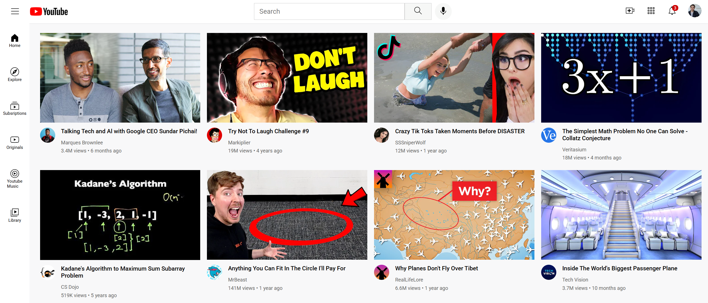

# YouTube Clone

A pixel-perfect recreation of the YouTube homepage built with pure HTML and CSS. This project demonstrates modern web development techniques including responsive design, CSS Grid, Flexbox, and component-based styling.

## 🚀 Features

- **Authentic YouTube Design**: Pixel-perfect recreation of YouTube's homepage layout
- **Fixed Header Navigation**: Functional search bar, logo, and navigation buttons
- **Responsive Sidebar**: Navigation menu with YouTube's standard categories
- **Video Grid Layout**: Dynamic grid displaying video thumbnails, titles, and metadata
- **Channel Integration**: Links to actual YouTube channels and videos
- **Modern CSS**: Uses CSS Grid, Flexbox, and modern styling techniques
- **Google Fonts**: Implements Roboto font family for authentic look

## 🎯 Components

### Header

- YouTube logo and branding
- Search functionality with voice search icon
- User account and notification icons
- Fixed positioning for persistent navigation

### Sidebar

- Navigation menu with icons
- Categories: Home, Explore, Subscriptions, Originals, YouTube Music, Library
- Fixed positioning for easy access

### Video Grid

- Responsive grid layout for video cards
- Video thumbnails with hover effects
- Channel profile pictures
- Video metadata (title, channel name, views, upload date)
- Direct links to actual YouTube content

## 🛠️ Technology Stack

- **HTML5**: Semantic markup and structure
- **CSS3**: Modern styling with Grid and Flexbox
- **Google Fonts**: Roboto font family
- **SVG Icons**: Scalable vector graphics for crisp icons

## 📁 Project Structure

```text
youtube_project/
├── html/
│   └── main.html          # Main HTML file
├── styles/
│   ├── general.css        # Global styles and resets
│   ├── header.css         # Header component styles
│   ├── sidebar.css        # Sidebar navigation styles
│   └── video-grid.css     # Video grid layout styles
├── Icons/                 # SVG icons for UI elements
├── thumbnails/            # Video thumbnail images
└── Channel Icons/         # Channel profile pictures
```

## 🎨 Styling Architecture

The project uses a modular CSS approach with separate stylesheets for different components:

- **general.css**: Base styles, typography, and global resets
- **header.css**: Header layout, search bar, and navigation
- **sidebar.css**: Fixed sidebar navigation and menu items
- **video-grid.css**: Video card layout and responsive grid

## 🚀 Getting Started

1. **Clone the repository**

   ```bash
   git clone https://github.com/yourusername/youtube-clone.git
   cd youtube-clone
   ```

2. **Open the project**

   ```bash
   # Navigate to the HTML file
   cd youtube_project/html

   # Open in your preferred browser
   open main.html
   # or double-click main.html in file explorer
   ```

3. **View in browser**
   - Open `youtube_project/html/main.html` in any modern web browser
   - No build process or server required!

## 📱 Browser Compatibility

- ✅ Chrome (recommended)
- ✅ Firefox
- ✅ Safari
- ✅ Edge
- ✅ Modern mobile browsers

## 🎯 Key Learning Outcomes

This project demonstrates:

- **CSS Grid & Flexbox**: Modern layout techniques
- **Component Architecture**: Modular CSS organization
- **Fixed Positioning**: Creating persistent UI elements
- **Responsive Design**: Adapting to different screen sizes
- **Typography**: Web font integration and text styling
- **Icon Integration**: SVG usage and styling
- **Hover Effects**: Interactive UI elements

## 🔧 Customization

### Adding New Videos

1. Add thumbnail images to `thumbnails/` folder
2. Add channel icons to `Channel Icons/` folder
3. Update `main.html` with new video data
4. Follow the existing HTML structure for consistency

### Styling Changes

- Modify individual CSS files for specific components
- Update `general.css` for global changes
- Use browser dev tools to test changes in real-time

## 📸 Screenshots


_Pixel-perfect recreation of YouTube's homepage_

## 🤝 Contributing

1. Fork the repository
2. Create a feature branch (`git checkout -b feature/amazing-feature`)
3. Commit your changes (`git commit -m 'Add some amazing feature'`)
4. Push to the branch (`git push origin feature/amazing-feature`)
5. Open a Pull Request

## 📝 License

This project is open source and available under the [MIT License](LICENSE).

## 🙏 Acknowledgments

- YouTube for the original design inspiration
- Google Fonts for the Roboto font family
- The web development community for best practices and techniques

---

**Note**: This is a learning project and is not affiliated with YouTube or Google. All YouTube content, logos, and trademarks belong to their respective owners.
